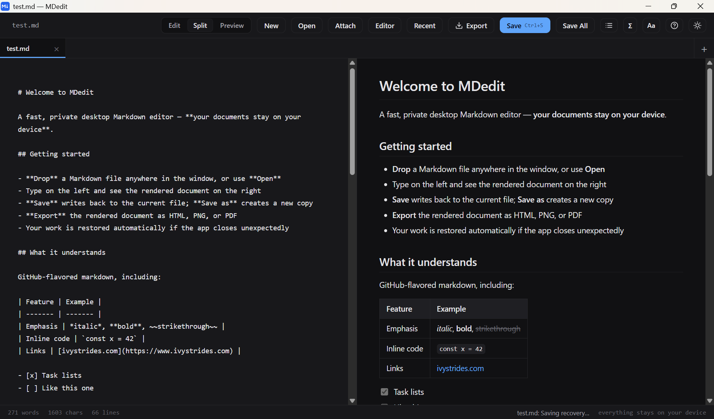
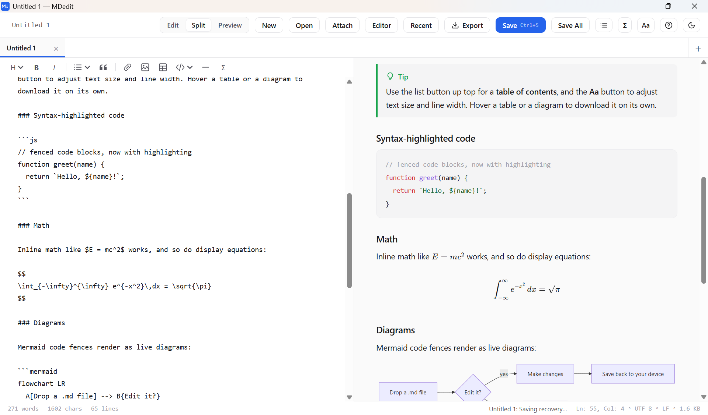

# MDedit

MDedit is a fast, private, cross-platform Markdown editor built with Tauri. It combines a focused source editor and live preview with native file handling, Mermaid diagrams, KaTeX math, and offline exports. Your documents stay local.

**Dark Mode Screenshot**


**Light Mode Screenshot**


## Features

- A tabbed workspace with independent editing state for every open document.
- Synchronized **Edit**, **Split**, and **Preview** modes.
- GitHub-flavored Markdown, task lists, tables, footnotes, and callouts.
- Syntax highlighting, Mermaid diagrams, and KaTeX math.
- Formatting shortcuts, automatic list continuation, and editor font, indentation, wrapping, and line-number preferences.
- Per-document find and replace with match-case, whole-word, and regular-expression modes.
- Desktop image and attachment import, external-change comparison, and tab context menus.
- Table of contents, reader controls, and light/dark themes.
- HTML, PNG, PDF, CSV, and SVG exports.
- Draft restoration and Markdown file associations.
- Desktop **Recent** menu remembers the last 20 files you opened or saved.

## Working with documents

Select **+** to create a new tab, or select **Open** to choose one or several files. Select a tab to make it active; the editor, preview, view mode, selection, scroll position, find state, exports, and Save commands follow the active document. You can also switch tabs with `Ctrl+Tab` and `Ctrl+Shift+Tab`.

In the desktop app, select **Recent** in the toolbar to reopen a file or return to its existing tab. Each entry shows its folder. Use **×** to remove an entry or **Clear recent documents** to clear the history; neither action deletes files or changes open tabs. History stays on your device, separately from session recovery. Untitled documents enter the list only after they are saved.

An unsaved change shows a dirty indicator on that document's tab and an asterisk in the window title. **Save** writes the active document, while **Save As** writes it to a new location. **Save All** writes every dirty document in tab order without closing MDedit. **Save All & Quit** in the close-application prompt performs the same ordered saves, then closes the application. Both commands ask for a destination for each untitled document and stop if a save is canceled or fails, leaving the remaining documents open and unchanged.

MDedit stores local recovery snapshots as you work and restores the tab order, active document, content, and per-document workspace state after an unexpected shutdown. When the file on disk has an external change, the conflict dialog offers **Reload Disk Version**, **Keep Editing**, and **Save Editor Version As**. A deleted source remains open and can be saved to a new location.

On Windows, desktop settings, WebView data, session recovery, and recent-file history are stored under `%LOCALAPPDATA%\com.skanga.mdedit`. To fully reset the app, close MDedit and delete the Local AppData folder; this removes unsaved recovery copies but leaves documents saved elsewhere untouched.

Closing the application always asks for confirmation. With clean documents, choose **Close** or **Cancel**. With dirty documents, choose **Save All & Quit**, **Quit and Restore Next Time**, **Discard All & Quit**, or **Cancel**. The restore choice checkpoints the whole session locally before closing; discard permanently removes the pending recovered edits.

Desktop exports use raw bytes and Tauri's native save dialog. The save dialog dynamically grants write access only to the selected destination; MDedit has no wildcard filesystem scope. Document saves and private recovery storage remain behind validated Rust commands.

### Editing and attachments

Use the compact toolbar above the source editor for headings, bold, italic, lists, blockquotes, links, images, tables, code, horizontal rules, and equations. **More formatting** appears only when the pane is narrow, collecting secondary actions. The toolbar appears in Edit and Split modes. Use **Editor → Show formatting toolbar** to hide or restore it; this preference persists locally. On desktop, Image opens the existing image/attachment importer; in the browser it inserts a Markdown image placeholder.

Use **Editor** for preferences. Font size, tab width, wrapping, and line numbers apply to every tab and persist locally. Enter continues bullets, numbered lists, and unchecked tasks; Enter on an empty list item ends the list. Shift+Enter inserts a plain newline. Formatting, indentation, list continuation, and replacement support Undo.

Find searches only the active document. **Match case**, **Whole word**, and **Regex** stay with that tab's query. Regex replacements support `$1`, `$2`, named groups (`$<name>`), `$&` for the match, and `$$` for a literal dollar sign. Invalid expressions show an error and disable replacement.

On desktop, **Attach**, image paste, or dropping an image or other attachment copies it into an `assets` folder beside the Markdown document and inserts a relative link. Untitled documents prompt for Save As first. Each imported asset gets a unique filename, and files are limited to 20 MiB each. Relative images resolve from the document folder, including `../` references. HTML exports embed local images and attachments; PNG and PDF include local images. Remote images retain the existing export limitations. Keep the Markdown file and its relative assets together when moving or copying a document to another folder.

### External changes and tab actions

The desktop app checks named files every three seconds while visible and when the window regains focus. A clean document reloads when its disk contents change. Unsaved edits remain intact, with **Compare changes** showing the editor and disk versions side by side. Choose **Keep editing**, **Save As…**, or **Reload from disk…**; discarding unsaved edits requires confirmation. A missing file remains open so its contents can be saved elsewhere.

Right-click a document tab, or focus it and press `Shift+F10`, for **Copy file path**, **Show in file manager**, **Save As…**, **Close tab**, and **Reopen closed tab**. Reopen remembers up to 20 closed saved files during the current session, reads their current disk contents, and restores their workspace state. Discarded untitled drafts are not retained in this list.

### Keyboard shortcuts

On macOS, use `Command` instead of `Ctrl` for the shortcuts below, except tab switching. Tab switching always uses `Ctrl`.

| Shortcut | Action |
| --- | --- |
| `Ctrl+S` | Save the active document |
| `Ctrl+Shift+S` | Save As for the active document |
| `Ctrl+O` | Open one or several documents |
| `Ctrl+F` | Find and replace in the active document |
| `Ctrl+Tab` / `Ctrl+Shift+Tab` | Switch to the next / previous tab |
| `Alt+Shift+Left` / `Alt+Shift+Right` | Move the active tab |
| `Ctrl+W` | Close the active document |
| `Ctrl+Shift+T` | Reopen the last closed saved file (desktop) |
| `Ctrl+B` / `Ctrl+I` | Toggle bold / italic |
| `Ctrl+K` / `Ctrl+E` | Insert a link / toggle inline code |
| `Ctrl+Shift+C` | Insert a fenced code block |
| `Ctrl+Alt+1`–`6` | Set or remove a heading level |
| `Enter` / `Shift+Enter` | Continue a list / insert a plain newline |
| `Tab` / `Shift+Tab` | Indent / outdent |

## Download

Download the [latest stable build from GitHub Releases](https://github.com/skanga/mdedit/releases/latest).

| Download | Platform | Description |
| --- | --- | --- |
| `MDedit_<version>_x64-setup.exe` | Windows x64 | Recommended NSIS installer |
| `MDedit_<version>_x64_en-US.msi` | Windows x64 | Managed/administrator MSI installer |
| `MDedit-portable-x64.exe` | Windows x64 | Portable executable; no installation required |
| `MDedit_<version>_aarch64.dmg` | macOS Apple silicon | Disk image |
| `MDedit_<version>_amd64.deb` | Ubuntu/Debian x64 | Debian package |

These are unsigned builds, so your operating system may show a warning.

## Windows installers

For most Windows users, choose the NSIS installer: `MDedit_<version>_x64-setup.exe`. For managed or administrator-led deployment, use the MSI installer: `MDedit_<version>_x64_en-US.msi`. Either installer registers Markdown file associations.

For a portable option, download and run `MDedit-portable-x64.exe` directly. It requires no installation, shortcuts, or file associations, but it does require the system Microsoft Edge WebView2 runtime. If WebView2 is missing or needs repair, use the NSIS installer to install or repair it. Portable preferences and restored drafts may still use the normal Windows app-data location. The NSIS installer is still recommended for most Windows users.

## Development

Install Node.js LTS, Python 3, Rust/Cargo, and the [official Tauri prerequisites](https://v2.tauri.app/start/prerequisites/). On Windows, also install Bash through Git Bash.

```bash
npm ci
npm test

# Build the desktop frontend and run MDedit in development.
npm run build:desktop
npm run tauri -- dev

# Create desktop bundles.
npm run tauri -- build

# Create a Windows NSIS installer.
npm run tauri -- build --bundles nsis
```

Pull requests run the unit, Rust, desktop-build, and Linux Chromium browser gates. The 250 MB browser benchmark and native recovery-write diagnostic run only for version tags or an explicit workflow dispatch; see [the performance evidence guide](docs/testing/tabbed-editor-performance.md).

## Project structure

| Path | Purpose |
| --- | --- |
| `src/index.template.html` | Source template for the desktop frontend |
| `src/native-bridge.js` | Native Tauri bridge used by the frontend |
| `src-tauri/` | Tauri application, Rust code, and bundle configuration |
| `vendor/` | Vendored frontend dependencies and KaTeX fonts |
| `build.sh` | Generates the frontend HTML assets |
| `tools/build-desktop.sh` | Builds and stages the frontend for Tauri |
| `.github/workflows/desktop.yml` | Desktop build and GitHub Release workflow |

`index.html` and `index-lite.html` are generated internals used as Tauri assets. Modify `src/index.template.html` and run `bash ./build.sh`; do not hand-edit generated files.

## Privacy

MDedit has no account, telemetry, document upload, or server-side rendering. Documents remain local. Remote transmission of documents is out of scope.

## Contributing

Issues and pull requests are welcome at [github.com/skanga/mdedit](https://github.com/skanga/mdedit). Before opening a change, run:

```bash
npm test
npm run build:desktop
cargo fmt --manifest-path src-tauri/Cargo.toml -- --check
cargo test --manifest-path src-tauri/Cargo.toml
```

When changing frontend source, commit the generated artifacts as well.

## License

MDedit is licensed under [MIT](LICENSE). See [THIRD-PARTY-NOTICES.md](THIRD-PARTY-NOTICES.md) and [`licenses/`](licenses/) for third-party notices and licenses.
